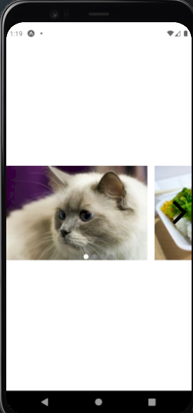
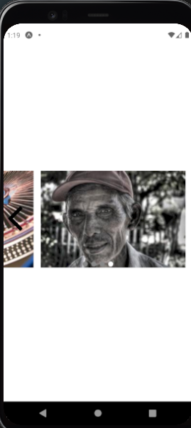
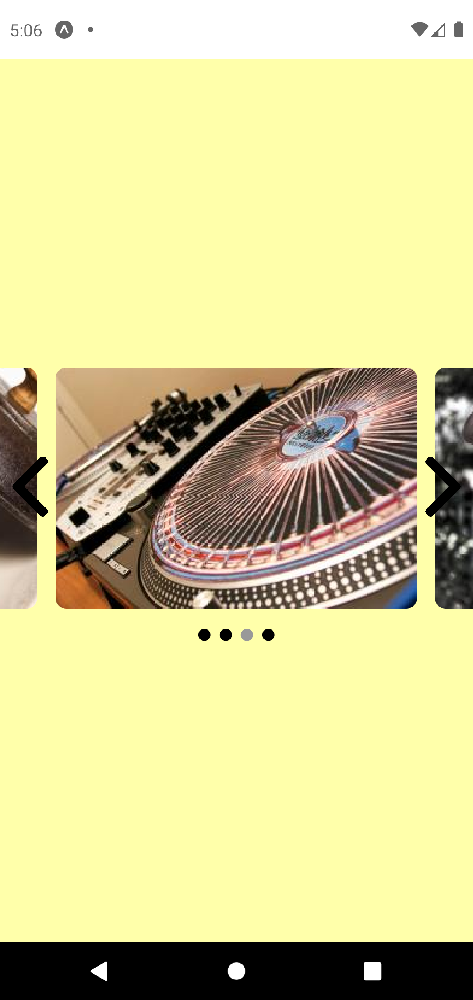

# Build a carousel without using existing plugins

##

<p align="center" width="100%">




</p>

## Available Scripts

In the project directory, you can run:

### `yarn install`

Install necessary packages

### `yarn start`

Runs the app in the development mode.\
Open the Expo interface view it in the browser.

## Requirements

- build a carousel.
- by default display 4 blocks.
- navigation is made with next and previous buttons.
- Next button should be disabled, if user is at the very end of the carousel.
- Previous button should be disabled, if user is at the very beginning of carousel.
- Clicking on next/previous buttons shows next/prev 4 carousel blocks accordingly.
- The source of carousel block is endpoint on server that return following JSON:

  ```
  [
    {
      title: "First Block",
      images: [url1, url2, url3]
    },
    {
      title: "Second Block",
      images: [url7, url8]
    },

    ...

  ]
  ```

- Display a random image for each block from the set of images.
- Additional Feature: We need to persist the last position of the carousel, so when the
  app closes and opens again we need to start the carousel in that stored position.
